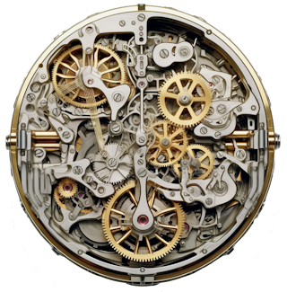

### Hi there 👋

 
  &nbsp;&nbsp;

<!--

-->

- 🔭 I’m working on architecture and the development, analysis are my hobbies (happy to connect in [LinkedIn](https://www.linkedin.com/in/jiristeuer/) also)
- ⚡ [Real facts](https://www.linkedin.com/search/results/content/?keywords=%23gosh2inout&sortBy=%22date_posted%22):
  - "If you want to show the reliability and quality ... show standard outputs, the test code coverage and vulnerability tests."
  - "Doing IT without IT is a beautiful idea ... fully functional only in the heads of an idealist and feasible in limited areas."
  - "Using the one universal hammer for everything is not always the best ... try to think about the differences and don't be lazy."
  - "How can you accelerate your innovation, simply? Reduce the quality, minimize effort in non-innovative areas such as tests, documentation, operations, security, etc."
  - "Added value does not end in perfectionism, but in the ability to connect things."
  - "The quality of the documentation will always be most appreciated by those who lack the documentation completely."
  - "Everyone makes mistakes, but only a donkey makes the same mistakes repeatedly, so feedback, a detailed look at the reasons for the failure and critical thinking are extremely important."
  - "You can run as fast as you want to the goal, but you won't reach the one ... Don't forget to first identify your maturity level and approve it with your stakeholders ..."
  - etc.

  <h2>Contact</h2>
  
  &nbsp;&nbsp;&nbsp;
  
    

